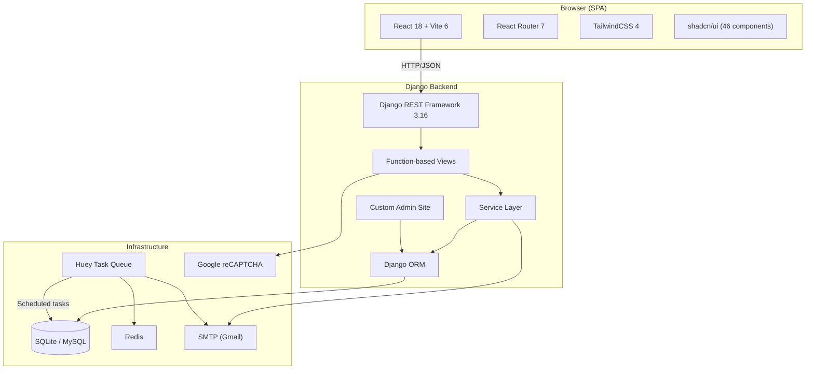
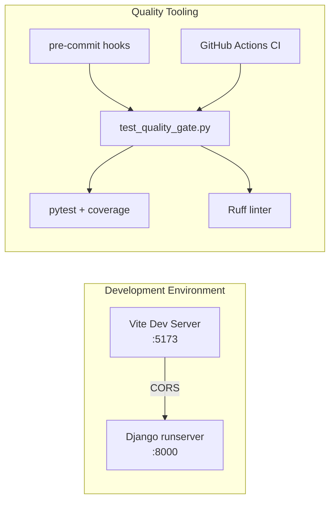
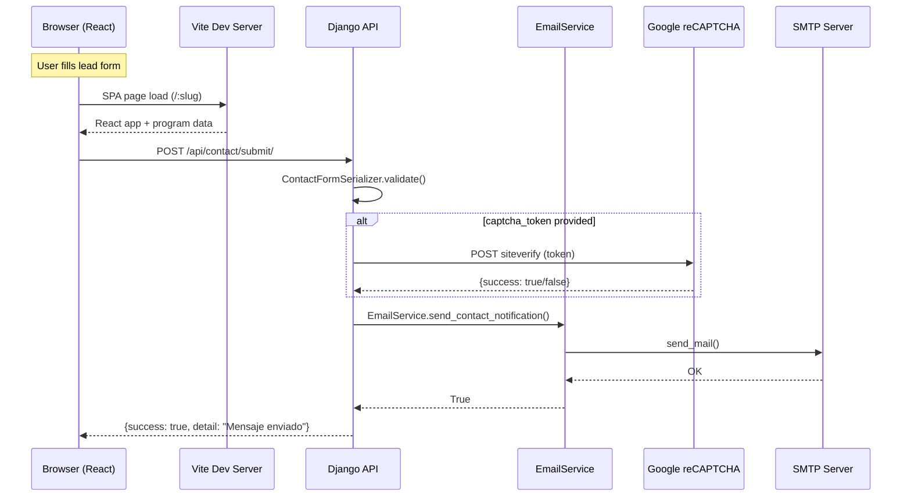
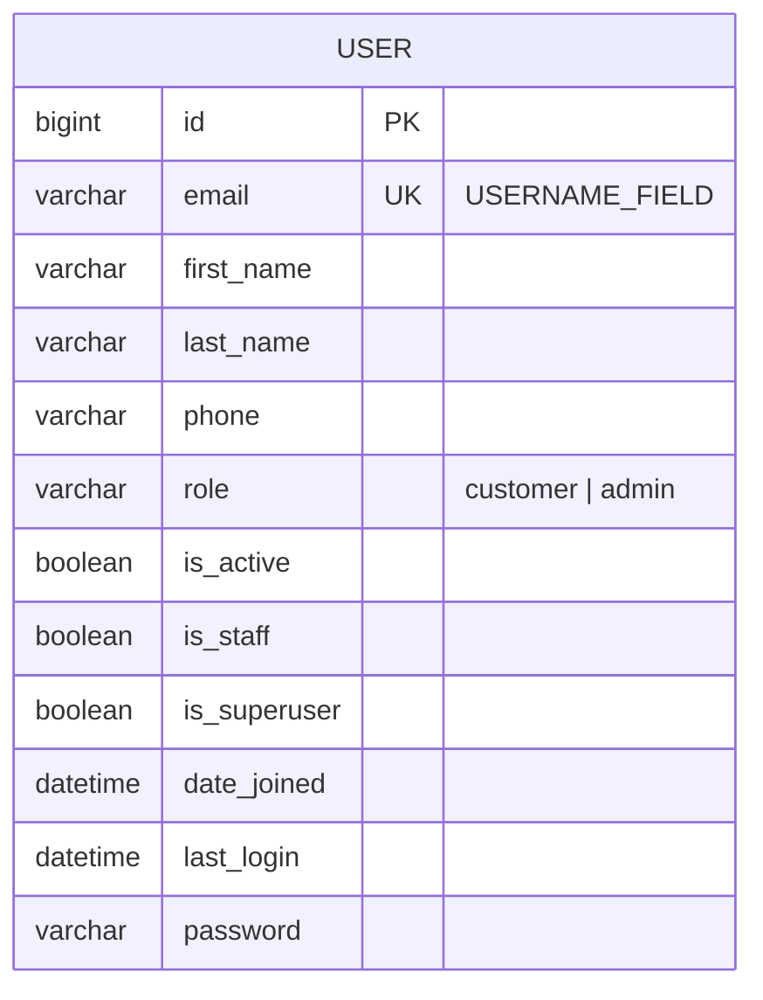
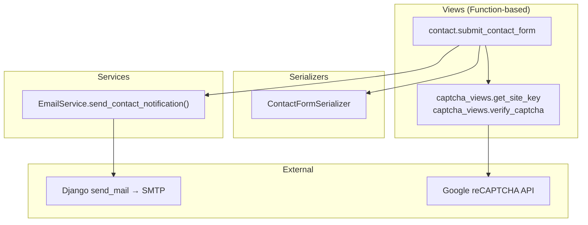
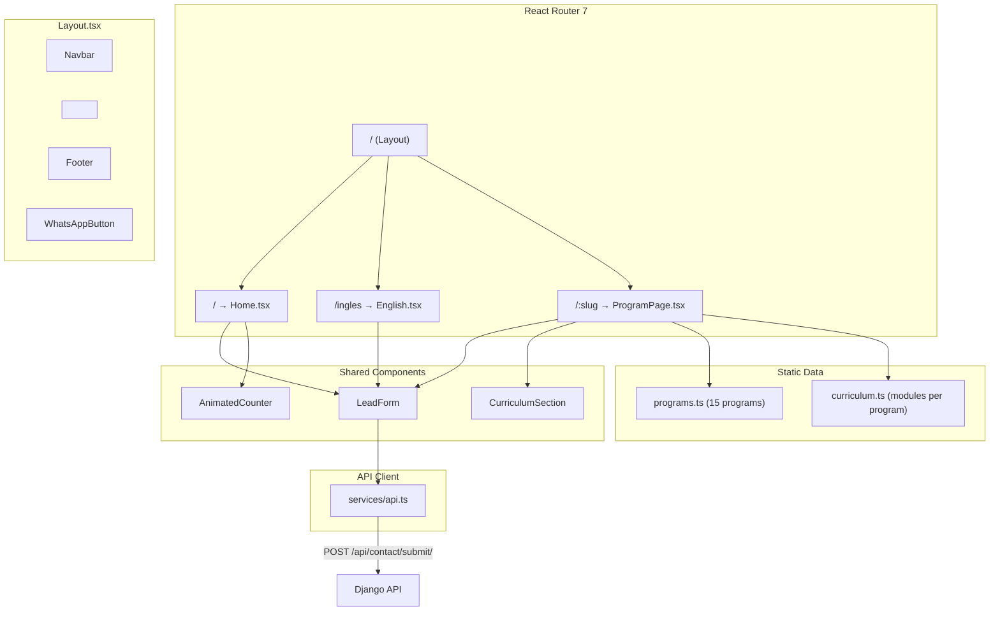
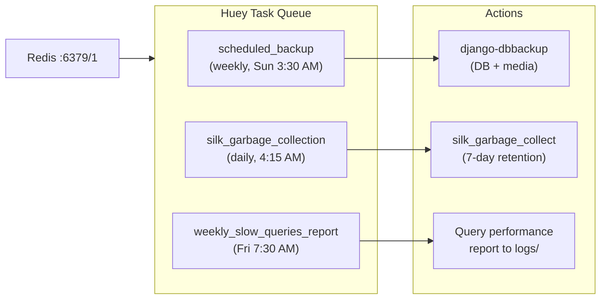
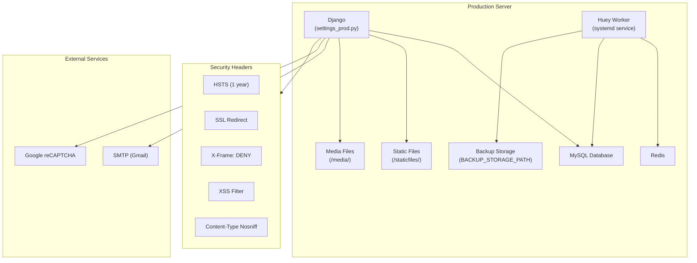

# Architecture — Corporación Fernando de Aragón

## 1. System Overview

---

## 2. Development Architecture

---

## 3. Request Flow

---

## 4. Entity-Relationship Diagram

**Notes:**
- `User` is the only model in the project (`base_feature_app`) — custom model with email as identifier
- `django_attachments` was removed during cleanup (2026-03-17) — it was unused code

---

## 5. Model Details

### base_feature_app.User

| Field | Type | Constraints |
|-------|------|-------------|
| `id` | BigAutoField | PK |
| `email` | EmailField | unique, USERNAME_FIELD |
| `first_name` | CharField(150) | blank |
| `last_name` | CharField(150) | blank |
| `phone` | CharField(50) | blank |
| `role` | CharField(20) | choices: `customer` (default), `admin` |
| `is_active` | BooleanField | default=True |
| `is_staff` | BooleanField | default=False |
| `is_superuser` | BooleanField | inherited from PermissionsMixin |
| `date_joined` | DateTimeField | default=timezone.now |
| `password` | CharField | inherited from AbstractBaseUser |
| `last_login` | DateTimeField | inherited from AbstractBaseUser |

**Manager**: `UserManager` — custom `create_user()` and `create_superuser()` methods

---

## 6. Service Layer

---

## 7. Page Routing & Frontend Architecture

---

## 8. Scheduled Tasks Architecture

---

## 9. Deployment Architecture (Production)

**Production requirements** (enforced by `settings_prod.py`):
- `DJANGO_SECRET_KEY` must be set
- `DJANGO_ALLOWED_HOSTS` must be set
- `DEBUG = False` always
- SMTP email backend required
- All security headers enabled

---

## 10. API Endpoints Summary

| Method | Endpoint | Permission | Description |
|--------|----------|------------|-------------|
| `GET` | `/api/health/` | AllowAny | Health check |
| `POST` | `/api/contact/submit/` | AllowAny | Submit lead form |
| `GET` | `/api/google-captcha/site-key/` | AllowAny | Get reCAPTCHA site key |
| `POST` | `/api/google-captcha/verify/` | AllowAny | Verify captcha token |
| — | `/admin/` | Staff | Custom admin site |
| — | `/admin-gallery/` | Staff | Default Django admin |
